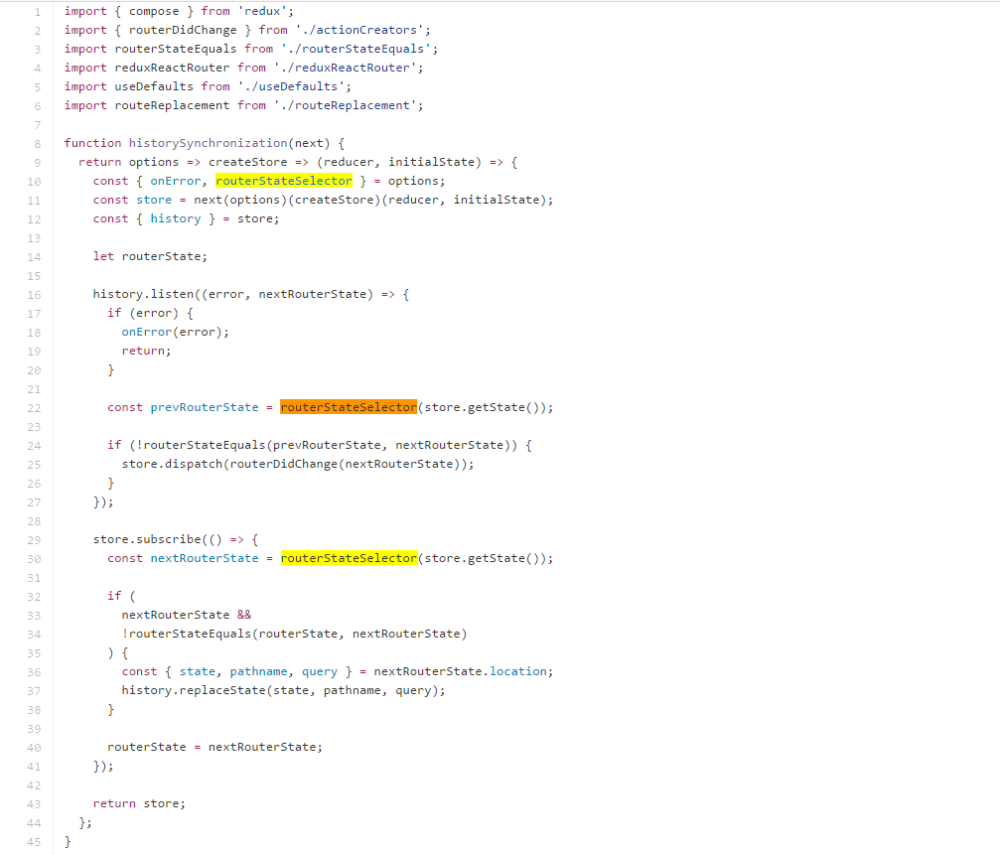

# github-source-highlight [![build][build-image]][build-url]

> highlight selected word in github source page

## Why?

`ctrl + F` is not case sensitive, and only highlight one matched word in one time

## License

MIT &copy; [fengzilong](https://github.com/fengzilong)

[build-image]: https://img.shields.io/circleci/project/fengzilong/github-source-highlight/master.svg?style=flat-square
[build-url]: https://circleci.com/gh/fengzilong/github-source-highlight
